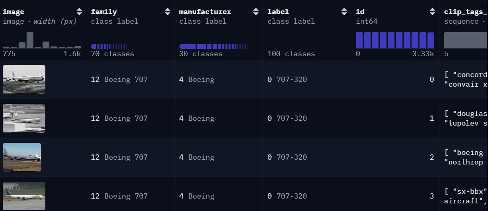

# Fine-Tuning Phi-3-vision-128k-instruct
This folder contains a Jupyter notebook for fine-tuning the `microsoft/Phi-3-vision-128k-instruct` language model for multi-modality tasks.

## Usage
1. Install the required Python libraries from `requirements.txt`:
```
pip install -r requirements.txt
```
2. Open the Jupyter notebook `Phi_3_Vision_Fine_tuning.ipynb` and follow the instructions provided within the notebook.

## Model Details
- Model name: `microsoft/Phi-3-vision-128k-instruct`
- Model card in Hugging Face: https://huggingface.co/microsoft/Phi-3-vision-128k-instruct

## Dataset
The fine-tuning dataset is sourced from HuggingFace and includes `Multimodal-Fatima/FGVC_Aircraft_train` for training and validation, and `Multimodal-Fatima/FGVC_Aircraft_test` for testing. Each dataset contains an image column along with several columns of textual information. In the notebook `Phi_3_Vision_Fine_tuning.ipynb`, the columns used are `image` and `Attributes_ViT_L_14_text_davinci_003_full`.

